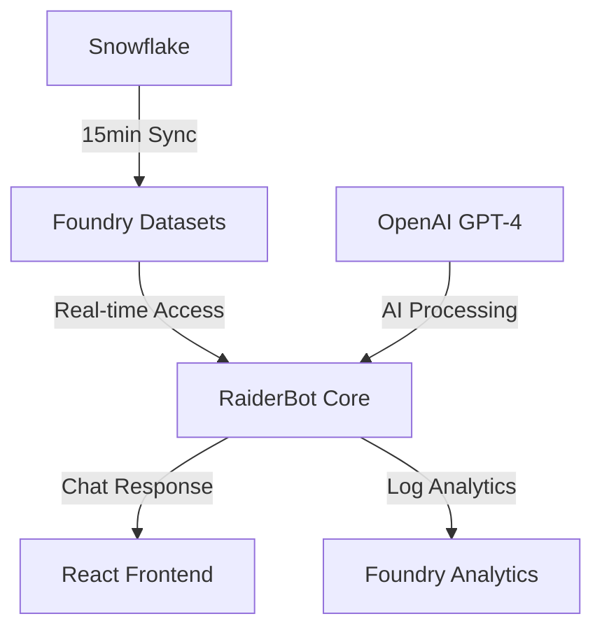

# 🏗️ RaiderBot Foundry Architecture

## Overview

RaiderBot is a German Shepherd AI assistant built on Palantir Foundry, designed for Raider Express transportation operations. The architecture emphasizes safety, real-time data access, and bilingual support.

## Core Components

### 1. Foundry Functions 🤖

```
palantir-functions/
└── raiderbot_core.py
```

- **Purpose**: AI chat handling and business logic
- **Features**:
  - German Shepherd personality
  - Bilingual (English/Spanish) support
  - Safety-first responses (60mph limit)
  - Real-time data access
  - Dashboard generation

### 2. Foundry Ontology 🔗

```
palantir-ontology/
└── objects/
    ├── driver.py
    ├── vehicle.py
    ├── delivery.py
    ├── route.py
    └── safety_incident.py
```

- **Purpose**: Transportation domain model
- **Key Objects**:
  - Drivers with safety metrics
  - Vehicles with speed governors
  - Deliveries with temperature tracking
  - Routes with safety compliance
  - Safety incidents for monitoring

### 3. Foundry Transforms ⚡

```
palantir-transforms/
└── snowflake_ingestion.py
```

- **Purpose**: Data synchronization and processing
- **Schedules**:
  - Deliveries: Every 15 minutes
  - Drivers: Every 30 minutes
  - Vehicles: Every 30 minutes
  - KPIs: Every 5 minutes

### 4. React Frontend 💻

```
applications/
└── chat/
    ├── src/
    │   ├── components/
    │   │   └── RaiderBotChat.tsx
    │   └── services/
    │       ├── mock-data.ts
    │       └── local-raiderbot.ts
    └── public/
```

- **Purpose**: User interface for RaiderBot
- **Features**:
  - Modern chat interface
  - Real-time updates
  - Bilingual support
  - Dashboard display

## Data Flow



## Security Architecture

### Authentication
- Foundry native authentication
- Role-based access control
- API key management for OpenAI

### Authorization Levels
1. Admin: Full access
2. Dispatcher: Operations view
3. Driver: Limited access
4. Analyst: Read-only

## Monitoring & Alerts

### Key Metrics
- Response time
- Request count
- Error rate
- Speed violations
- Safety scores

### Alert Thresholds
- Response time > 2000ms
- Error rate > 1%
- Any speed > 60mph

## Development Workflow

### Local Development
1. Mock data services
2. Local React server
3. Simulated responses

### Foundry Deployment
1. CLI authentication
2. Workspace setup
3. Component deployment
4. Verification tests

## Integration Points

### External Systems
- Snowflake (data source)
- OpenAI (GPT-4)
- Mobile apps
- Telematics systems

### Internal Services
- Foundry datasets
- Transform pipelines
- Analytics workflows
- Monitoring systems

## Performance Considerations

### Optimization
- Dataset caching
- Response memoization
- Batch processing
- Query optimization

### Scalability
- Horizontal scaling
- Load balancing
- Resource allocation
- Connection pooling

## Success Metrics

### Operational
- 99.9% uptime
- <500ms response time
- Zero speed violations
- 100% safety compliance

### User Experience
- Natural conversations
- Accurate responses
- Real-time updates
- Seamless bilingual support

## Future Enhancements

### Planned Features
1. Advanced route optimization
2. Predictive maintenance
3. Weather integration
4. Enhanced dashboards

### Technical Roadmap
1. Multi-region deployment
2. Enhanced caching
3. ML model integration
4. Mobile app support

## Appendix

### Environment Variables
```yaml
FOUNDRY_URL: ${FOUNDRY_URL}
OPENAI_API_KEY: ${FOUNDRY_SECRET:openai_api_key}
MAX_SPEED_LIMIT: "60"
LANGUAGE_SUPPORT: "en,es"
```

### Deployment Commands
```bash
# Deploy all components
./deployment/deploy-to-foundry.sh

# Test deployment
foundry ai test raiderbot --scenario basic_chat
```

### Support Contacts
- Foundry Support: [foundry-support@palantir.com](mailto:foundry-support@palantir.com)
- RaiderBot Team: [raiderbot@raiderexpress.com](mailto:raiderbot@raiderexpress.com)

🐕 Woof! Architecture documentation complete! 